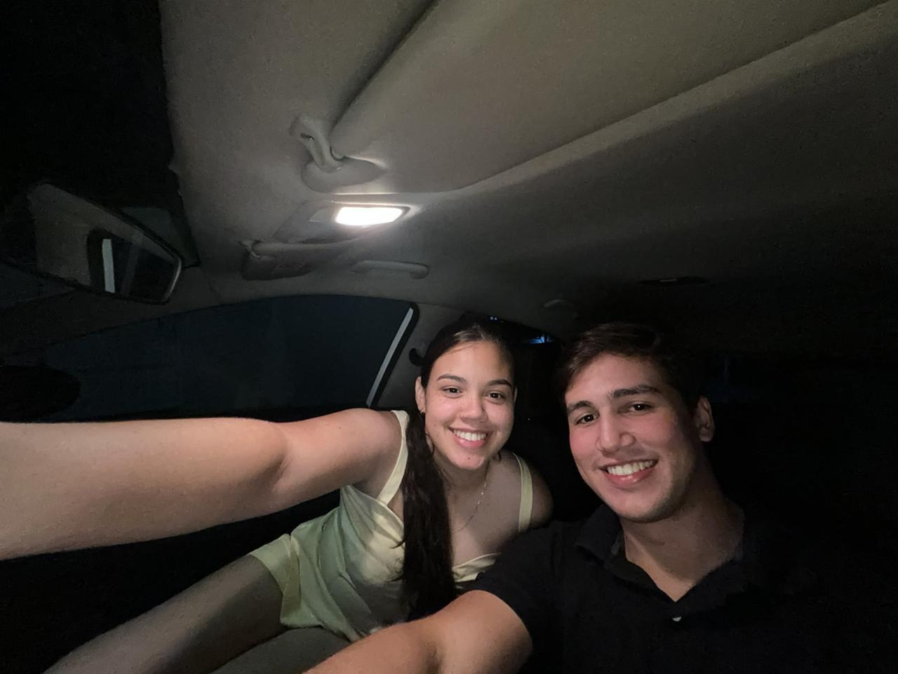
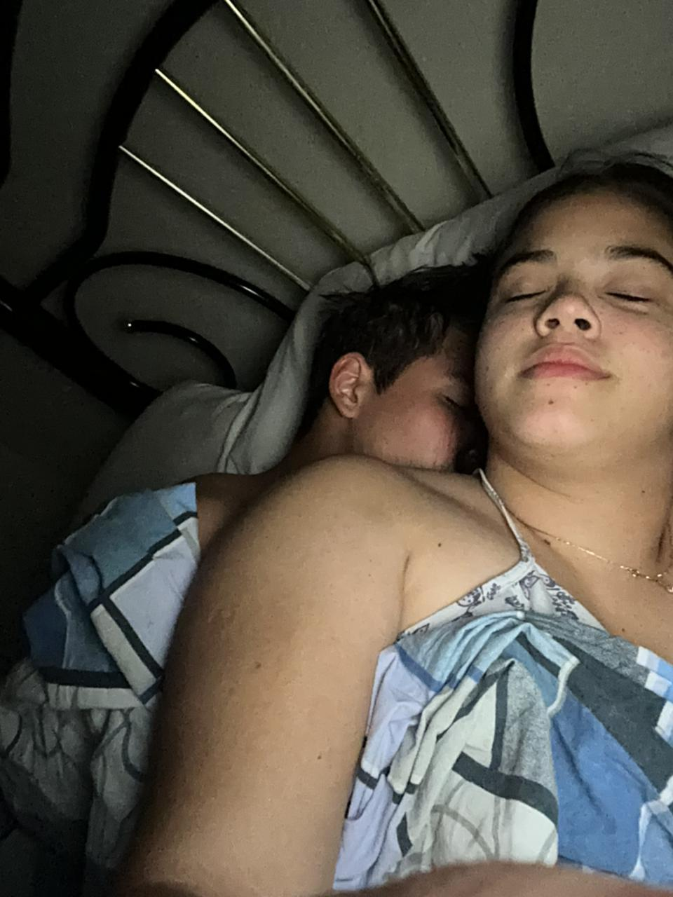

<!DOCTYPE html>
<html lang="pt-br">
<head>
    <meta charset="UTF-8">
    <meta name="viewport" content="width=device-width, initial-scale=1.0">
    <link rel="stylesheet" href="style.css">
    <title>Nosso Mural de Memórias</title>
</head>
<body>

    <header>
        <h1>Achei que ia gostar de relembrar alguns momentos especiais</h1>
        
Cada momento guardado com carinho.

    </header>

    <main class="mural">
        
        <article class="card">
            
            

                
"Este foi o dia em que percebi que cada conversa nossa se torna inesquecível, por mais que tenhamos dificuldades sempre consiguimos nos resolver."

                
            

        </article>

        <article class="card">
            
            

                
"O melhor lugar do mundo é sempre onde você está. Sinto uma paz inexplicável."

                
            

        </article>

        <article class="card">
            
            

                

                
"Sorrisos bobos, conversas infinitas e a certeza de que quero repetir isso."

                
            

        </article>

    </main>
